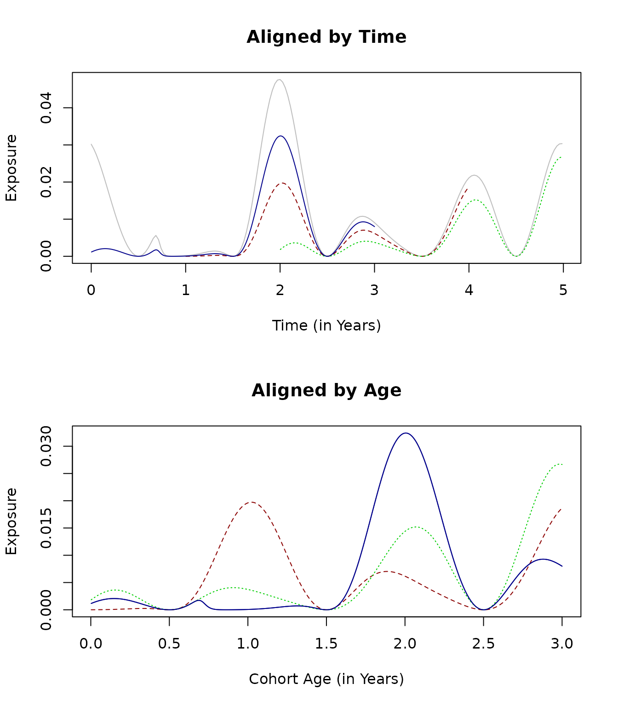
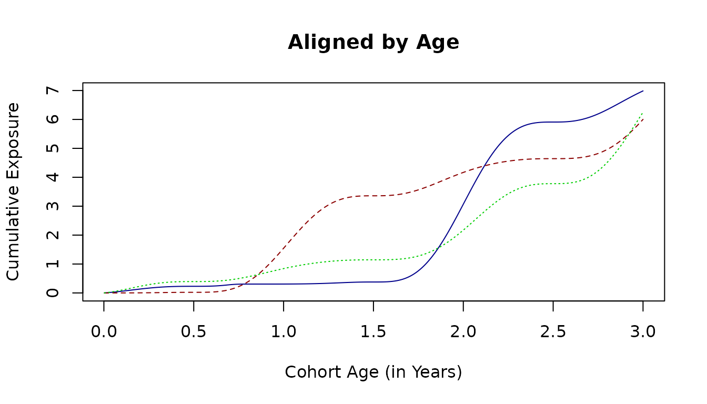

# Cohort Dynamics

To construct a trace function to models exposure in different cohorts in
the same population as they age:

    ?make_F_a

------------------------------------------------------------------------

To understand or compare models for malaria epidemiology, we will often
find it useful to construct trace functions describing exposure — either
the daily entomological inoculation rate (EIR) or the force of infection
(FoI) — in cohorts as they age.

Average exposure in the population is specified by a [**composed time
series**
function](https://dd-harp.github.io/ramp.func/articles/TimeSeries.html).
\\E(t) = \bar E \times F_S(t) \times F_T(t) \times F_K(t)\\

If we want to compare cohorts in the same population, then we must
acknowledge that exposure differs by age. To model exposure, we
construct a function to model relative biting rates by age:
\\F\_\omega(a)\\ To model exposure for a cohort born on day \\d,\\ we
note that time and age are related by \\a = t-d.\\ Exposure with respect
to age for that cohort is thus: \\E(a, d) = \bar X \times F\_\omega (a)
\times F_S(t-d) \times F_T(t-d) \times F_K(t-d).\\

The function `make_F_a` is written with options to control the interval
over which the temporal pattern is normalized, and whether the shock
function is used for normalization.

## Example

### Exposure in a Population

``` r

library(ramp.func)
```

To illustrate, we build a seasonal pattern function…

``` r

Sp <- makepar_F_sin()
F_s <- make_F_t(Sp)
```

a trend function…

``` r

Tp <- makepar_F_spline(tt=365*c(0:5), yy=c(1,1,1.6,.3,.7,1))
F_t <- make_F_t(Tp)
```

and a shock function.

``` r

Kp <- makepar_F_sharkbite(D=260, L=300)
F_k <- make_F_t(Kp)
```

We can plot the individual components to see how they’re shaping
exposure.


Over time, exposure in the population looks like this:


### Age

The default function \\F\_\omega\\ for relative biting rate by age looks
like this over the first 5 years of life:

``` r

Sa <- makepar_F_type2()
F_a <- make_F_t(Sa)
aa <- 1:(5*365)
plot(aa/365, F_a(aa), type = "l", 
     xlab = "a - Cohort Age (in Years)", ylab = expression(F[omega](a)))
```


### Exposure \\\times\\ Age

Over the first three years of life, the patterns of exposure are quite
different. In particular, exposure for the cohort born a year after the
start of the study (dark red, dashed line) peaks in the first year of
life. The cohort that was born at the beginning of the study (dark blue,
solid) had low exposure initially, but was exposed during the third year
peak at a higher rate than the younger cohorts.

``` r

par(mfrow = c(2,1))
Fa <- make_F_a(avg=5/365, age_par=Sa, season_par=Sp, 
               trend_par=Tp, shock_par=Kp, times = tt)

aa <- 1:1095

plot(tt/365, F(tt), main = "Aligned by Time", col = "grey", 
     type ="l", ylab = "Exposure", xlab = "Time (in Years)")

lines(aa/365+1, Fa(aa, d=365), col = "darkred", lty=2)
lines(aa/365+2, Fa(aa, d=730), col = "green3", lty =3)
lines(aa/365, Fa(aa), col = "darkblue") 

plot(aa/365, Fa(aa), main = "Aligned by Age", col = "darkblue", 
     type ="l", ylab = "Exposure", xlab = "Cohort Age (in Years)")

lines(aa/365, Fa(aa, d=365), col = "darkred", lty=2)
lines(aa/365, Fa(aa, d=730), col = "green3", lty =3)
lines(aa/365, Fa(aa), col = "darkblue")
```



``` r

par(mfrow = c(1,1))
plot(aa/365, cumsum(Fa(aa)), main = "Aligned by Age", col = "darkblue", 
     type ="l", ylab = "Cumulative Exposure", xlab = "Cohort Age (in Years)")

lines(aa/365, cumsum(Fa(aa, d=365)), col = "darkred", lty=2)
lines(aa/365, cumsum(Fa(aa, d=730)), col = "green3", lty =3)
```


