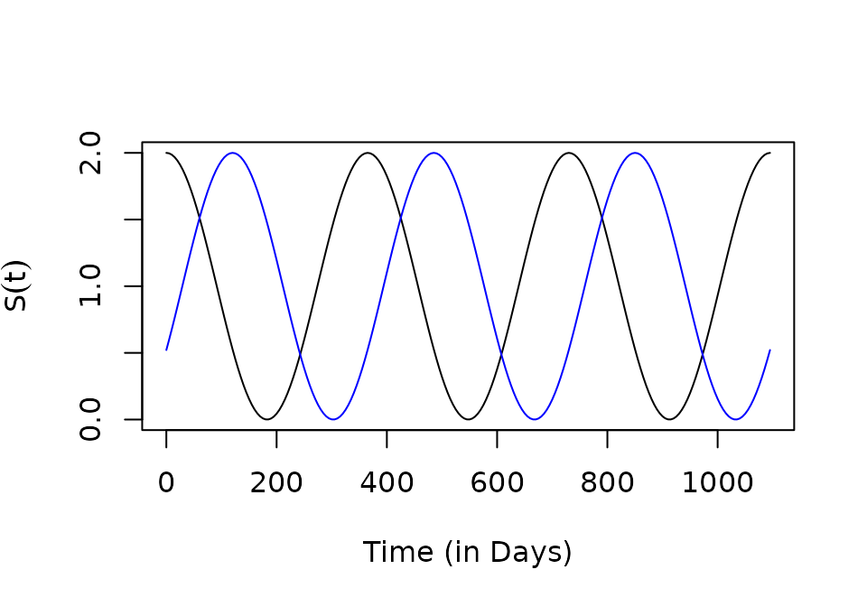
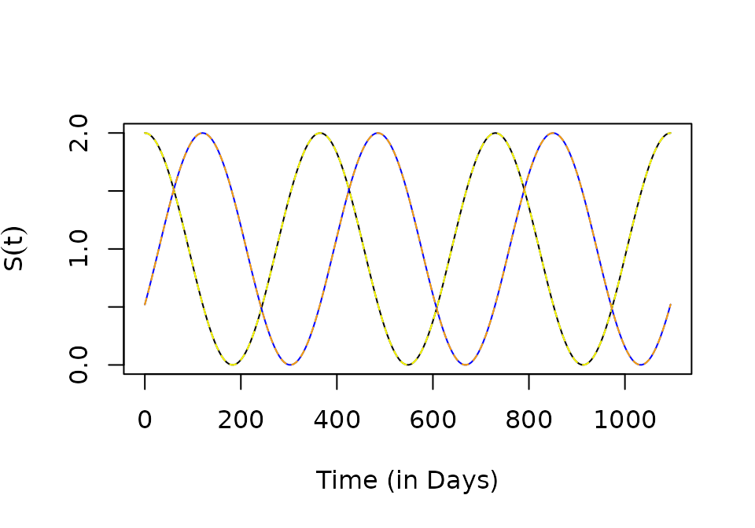
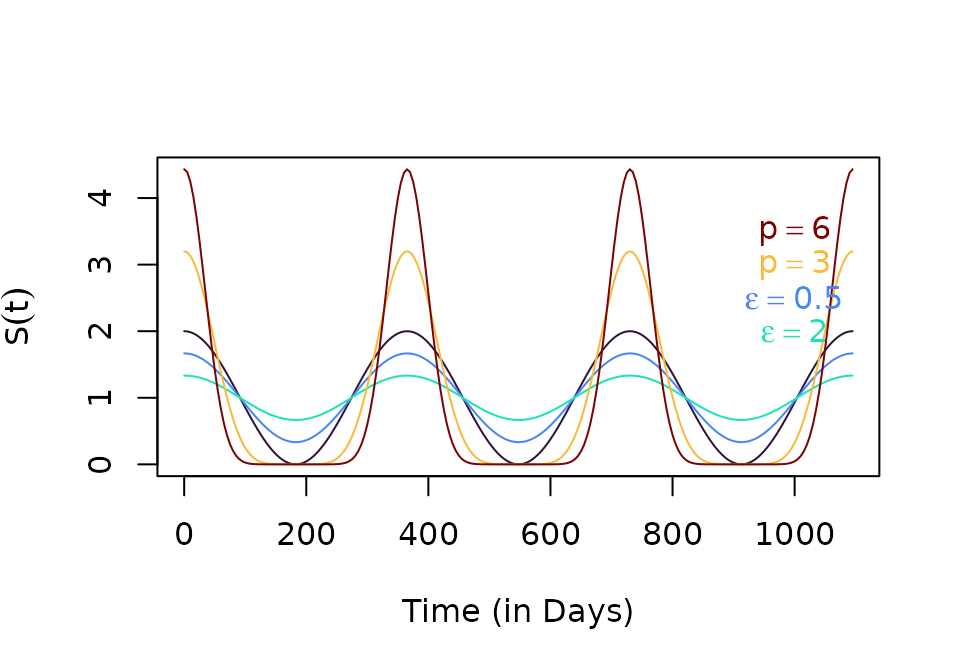

# Sin

``` r

library(ramp.trace)
library(viridisLite)
```

A constructor for seasonality functions drawn from a generalized family
involving trigonometric functions is returned by `make_function.sin`
with the associated `makepar_F_sin` that returns functions of the form:
\\S(t) = c\left(1 + \epsilon + \sin\left(\frac{2 \pi
(t-\tau)}{365}\right)\right)^p\\

- \\c\\ or `norm` is a normalizing constant

- \\\tau\\ or `phase` sets the timing of the peak

- \\\epsilon \geq 0\\ or `bottom` is a shape parameter: increasing the
  values of \\\epsilon\\ reduces the variance

- \\p \geq 0\\ or `pw` is a shape parameter.

``` r

p1 = makepar_F_sin()
S1 <- make_function(p1)
```

The default normalizing constant is \\365\\ so that if \\S\\ is
multiplied by some other constant, \\m,\\ the average daily value of the
function over a year is \\1.\\

``` r

integrate(S1, 0, 365)$val
```

    ## [1] 365

``` r

tt <- seq(0, 3*365, by=5)
plot(tt, S1(tt), type ="l", xlab = "Time (in Days)", ylab = expression(S(t)))
```


``` r

p2 = makepar_F_sin(phase=120)
S2 <- make_function(p2)
```

``` r

plot(tt, S1(tt), type ="l", xlab = "Time (in Days)", ylab = expression(S(t)))
lines(tt, S2(tt), col = "blue")
```



The function can return a vector of \\N\\ functions, each one configured
as if \\N=1\\

``` r

p3 = makepar_F_sin(phase = c(0,120), N=2)
S3 <- make_function(p3)
```

``` r

s3 <- S3(tt) 
plot(tt, s3[1,], type ="l", xlab = "Time (in Days)", ylab = expression(S(t)))
lines(tt, S1(tt), col = "yellow", lty=2)
lines(tt, s3[2,], col = "blue")
lines(tt, S2(tt), col = "orange", lty=2)
```



``` r

p4 <- makepar_F_sin(bottom=.5)
p5 <- makepar_F_sin(bottom=2)
p6 <- makepar_F_sin(pw=3)
p7 <- makepar_F_sin(pw=6)
```

``` r

S4 <- make_function(p4)
S5 <- make_function(p5)
S6 <- make_function(p6)
S7 <- make_function(p7)
```

The shape parameters make it easy to configure a seasonality function
with a range of features:

``` r

clrs = turbo(7)
plot(tt, S7(tt), type ="n", xlab = "Time (in Days)", ylab = expression(S(t)))
lines(tt, S1(tt), col = clrs[1])
lines(tt, S4(tt), col = clrs[2])
lines(tt, S5(tt), col = clrs[3])
lines(tt, S6(tt), col = clrs[5])
lines(tt, S7(tt), col = clrs[7])
text(1000, 3.5, expression(p==6), col=clrs[7])
text(1000, 3, expression(p==3), col=clrs[5])
text(1000, 2.5, expression(epsilon==0.5), col=clrs[2])
text(1000, 2, expression(epsilon==2), col=clrs[3])
```


